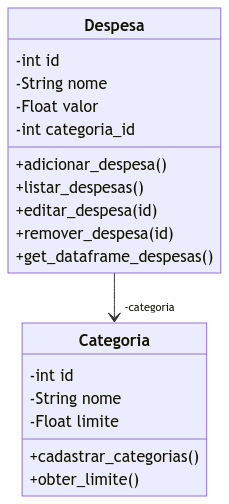
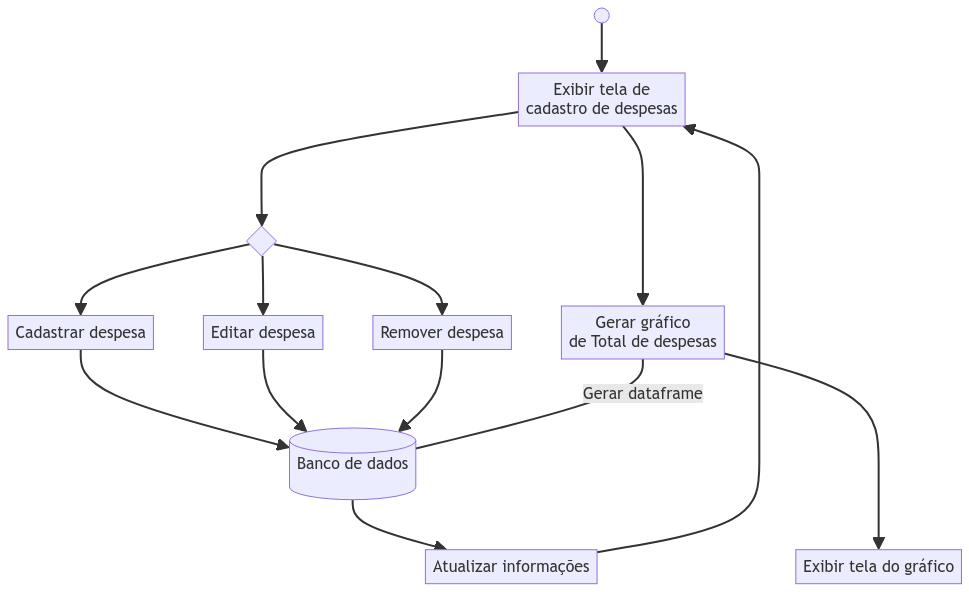

# Gerenciamento Despesas Pessoais - GDP
**Escopo do Sistema**: O objetivo do sistema é proporcionar aos usuários uma plataforma simples e eficaz para o gerenciamento de suas despesas pessoais. Com uma interface intuitiva os usuários podem adicionar, excluir, visualizar e editar despesas.

## Backlog
Backlog e Backlog do Sprint podem ser encontrados na aba de projetos ou acessando https://github.com/users/AlexCavalieri/projects/2

## Membros da Equipe
- **Lucas Henrique Silveira** - Fullstack developer
- **Augusto Ribeiro** - Fullstack developer
- **Israel de Melo Pedrosa** - Fullstack developer
- **Alexander Martins Cavalieri** - Fullstack developer
 
## Tecnologias
  HTML
  CSS
  JavaScript
  SQLite
  Python (_Flask_)
  
## Diagrama de Classes
  

   
  

##Diagrama de Atividades
  

   
  

